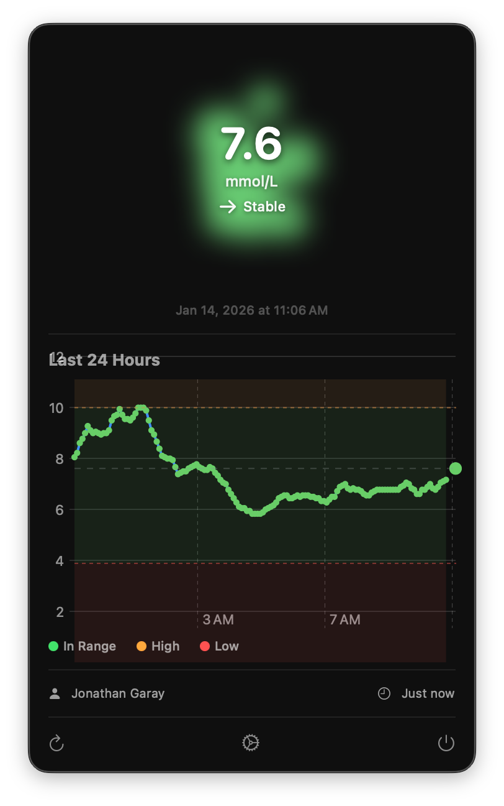
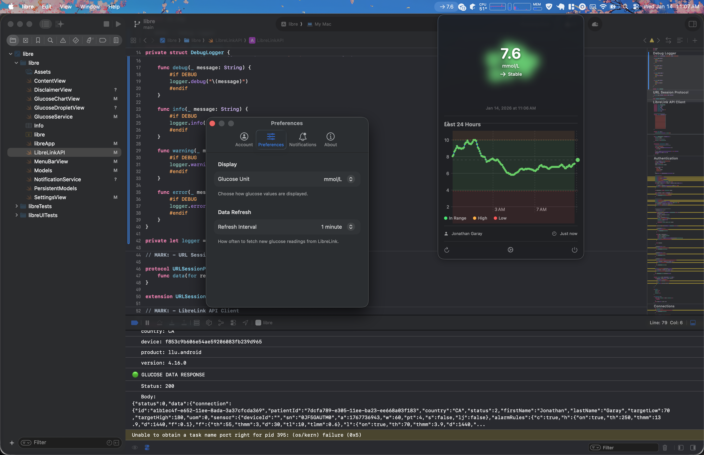
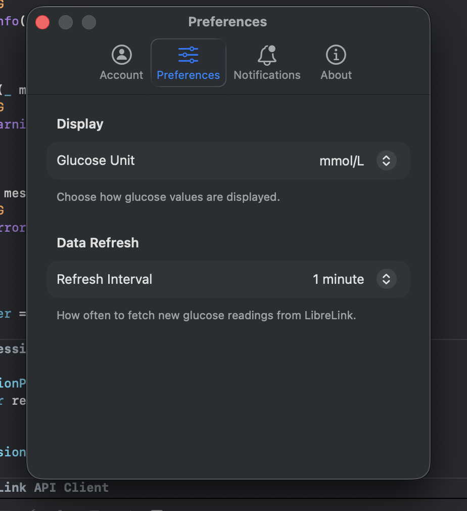

# Libre

A macOS menu bar app for monitoring glucose levels from FreeStyle Libre sensors via LibreLinkUp.

## Features

- Real-time glucose display in menu bar with trend arrow
- 3D droplet visualization color-coded by glucose status
- 24-hour glucose chart
- Notifications for high/low/urgent glucose levels
- Support for mg/dL and mmol/L units
- Local data persistence with SwiftData
- Multi-region support

## Screenshots

| Menu Bar Popup | Full View | Settings |
|:-:|:-:|:-:|
|  |  |  |

## Requirements

- macOS 14.0+
- LibreLinkUp account with shared glucose data

## Installation

1. Clone the repository
2. Open `libre.xcodeproj` in Xcode
3. Build and run

## Configuration

1. Launch the app (appears in menu bar)
2. Accept the disclaimer on first launch
3. Click the menu bar icon → Settings
4. Select your region and log in with LibreLinkUp credentials
5. Configure notification thresholds in the Notifications tab

## Disclaimer

**IMPORTANT: This application is for INFORMATIONAL PURPOSES ONLY.**

This app is not a medical device and should not be used to make medical decisions. The glucose readings displayed may be delayed, inaccurate, or incomplete.

**DO NOT** use this application to make treatment decisions regarding insulin dosing, food intake, or any other medical interventions. Always consult your glucose meter, continuous glucose monitor, or healthcare provider before making any medical decisions.

By using this application, you acknowledge that:
- This app is not intended to replace professional medical advice, diagnosis, or treatment
- Any decisions you make based on information from this app are your sole responsibility
- The developers are not liable for any harm resulting from the use of this app

This app uses the unofficial LibreLinkUp API. It is not affiliated with or endorsed by Abbott Laboratories.

## License

MIT License - see [LICENSE](LICENSE)
